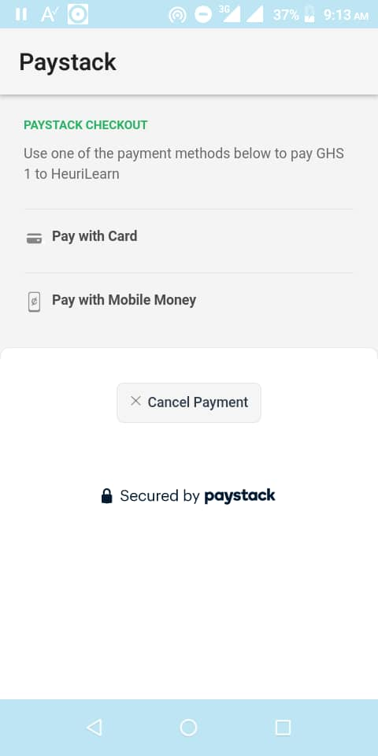
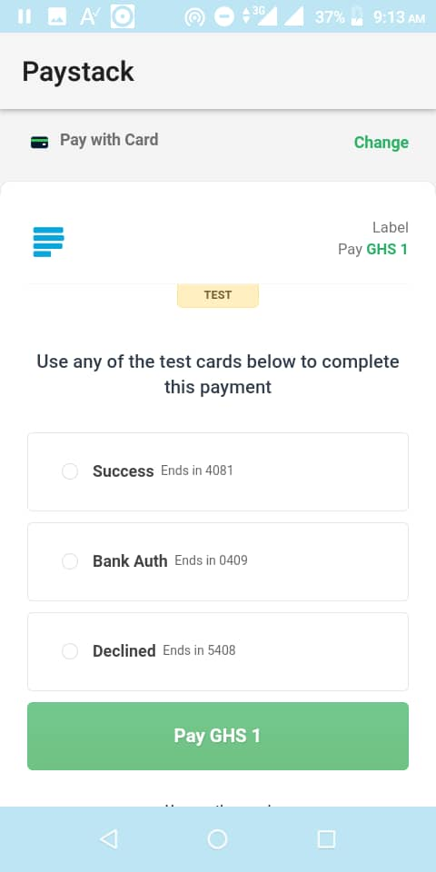
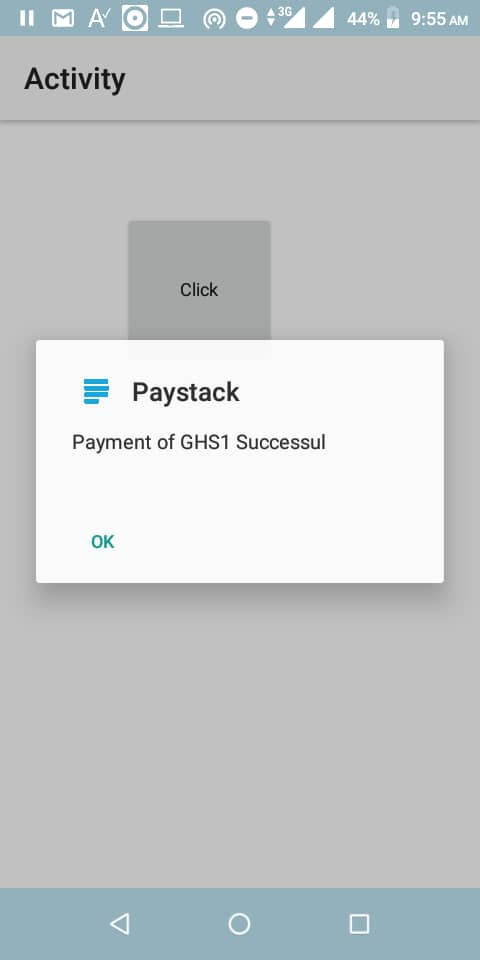

[](https://android-arsenal.com/api?level=16)


## Paystack B4A Android Library

This is a library for easy integration of [Paystack](https://paystack.com) with your Android application with [B4A](https://www.b4x.com/b4a.html).
Use this library in your B4A project.

## Summarized flow

1. Collect user's details such as email & name

2. Initialize the transaction
	- Call the [Initialize Transaction](https://paystack.com/docs/api/#transaction-initialize) endpoint
    - App will loads [WebView](https://b4x.com/android/help/views.html#webview) to initialize a transaction
    - User enter details for transaction

4. Once successful, a prompt will be displayed.

## Requirements
- Android SDKv16 (Android 4.1 "Jelly Bean") and above

## Installation & Usage

### B4A
#### Download Paystack.jar & Paystack.xml and place in your additional libraries folder
#### Enable the Paystack Library in your Libraries Tab
#### Assign Paystack Library to a Variable

```
Sub Globals
	Dim Pay As Paystack
End Sub
```
#### Initialize Paystack Library
```
Sub Activity_Create(FirstTime As Boolean)
	Activity.LoadLayout("Layout")	
	Pay.Initialize("Pay","pk_test_xxxxx",Me,Activity)
End Sub
```
#### Add to Manifest
```
AddApplicationText(
<meta-data
    android:name="co.paystack.android.PublicKey"
    android:value="pk_test_xxx"/>
```

#### Perform a transaction
```
Sub Button1_Click
	Pay.InitializeTransaction("oxxx@gmail.com", 1,"test-1234567890",Pay.CURRENCY_GHS)
End Sub
```
## Demo
Download/Clone [https://github.com/claudeamadu/paystack-b4a/tree/main/Demo](https://github.com/claudeamadu/paystack-b4a/tree/main/Demo)
<br/></img> </img> </img> </img> 

## Security

If you discover any issues, please email obiriclaude@gmail.com.

## Contact

For more enquiries and technical questions regarding the B4A Android PaystackSdk, please post on 
our issue tracker: [https://github.com/claudeamadu/paystack-b4a/issues](https://github.com/claudeamadu/paystack-b4a/issues).

## Change log

Please see [CHANGELOG](CHANGELOG.md) for more information what has changed recently.

